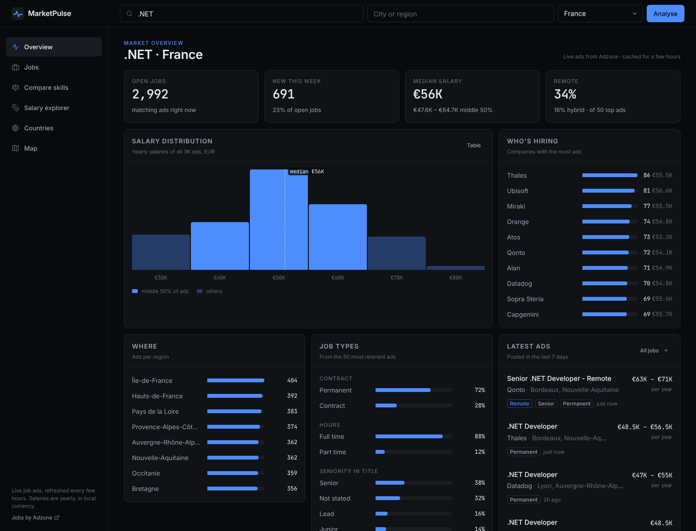
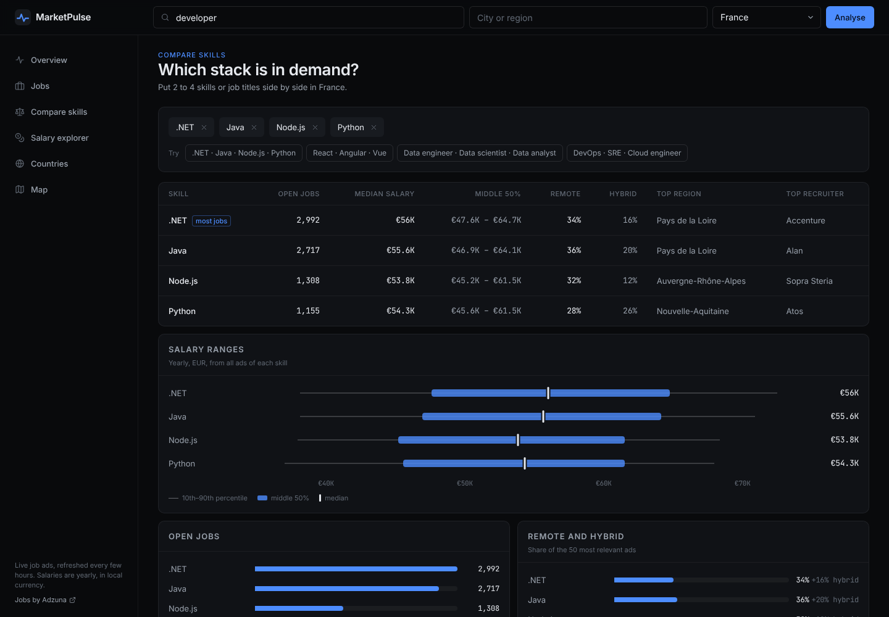
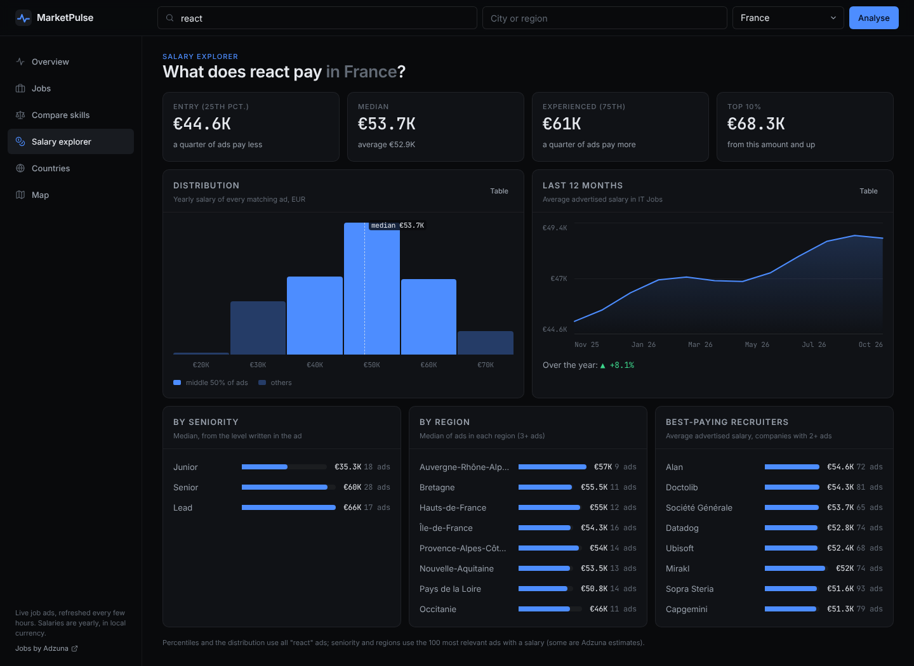
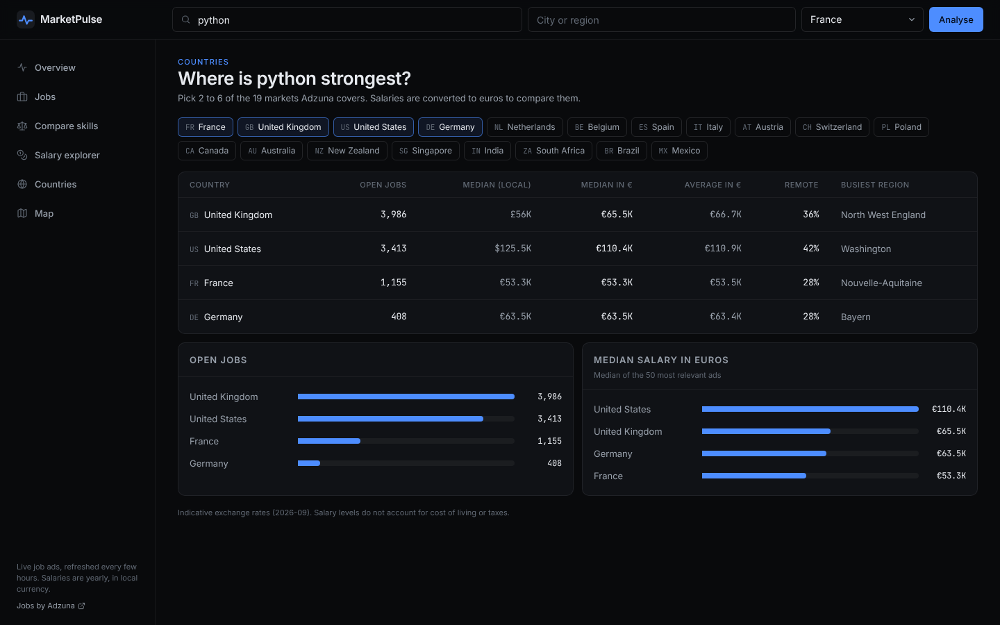
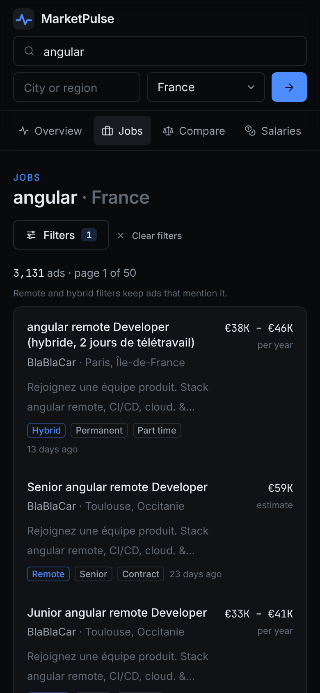

# MarketPulse

Job market intelligence from live job ads. Pick a skill or job title, a location and one of 19 countries, and MarketPulse shows how big the market is, what it pays, how much of it is remote, who is hiring and where.

Live: https://marketpulse.anasserekysy.com



## Features

**Overview.** Open jobs, new ads this week, median salary with the middle 50%, remote and hybrid share, the salary distribution of every matching ad, top recruiters, ads per region, contract and seniority mix, and the latest ads.

**Jobs.** The ads themselves, with filters for date, remote or hybrid, contract, hours, minimum salary and category, real pagination, and a link to each original ad.

**Compare skills.** Put 2 to 4 skills or job titles side by side (for example .NET, Java, Node.js and Python): open jobs, salary ranges on one scale, remote share, top region and top recruiter.



**Salary explorer.** Percentiles (25th, median, 75th, top 10%), the full distribution, 12 months of salary history for the job category, and medians by seniority, by region and by recruiter.



**Countries.** The same search in up to 6 of the 19 markets Adzuna covers, with salaries converted to euros.



**Map.** Where the ads are, on a dark map, with the count per region.

Every chart has a text or table equivalent, the search lives in the URL (any view can be shared), and the layout works on phones.



## How it works

```
client/                       Angular 19 app (pages, shared charts, core services)
client/e2e/                   Playwright tests (API mocked in e2e/mock-api.ts)
server/src/MarketPulse.Domain           Job model, classifiers (remote, seniority), statistics
server/src/MarketPulse.Application      Use cases per screen, ports (IJobMarket, ICache), DTOs
server/src/MarketPulse.Infrastructure   Adzuna client, quota guard, memory + disk cache
server/src/MarketPulse.Api              Minimal API endpoints, serves the Angular build
server/tests/MarketPulse.Tests          xUnit tests
deploy/                       docker-compose.prod.yml, deploy.sh, nginx site
Dockerfile                    client build + API publish + runtime image
```

- **Data:** the [Adzuna API](https://developer.adzuna.com/) (search, salary histogram, salary history, regions, top companies, categories).
- **Quota-aware:** Adzuna's free plan allows about 250 calls a day. Every answer is cached in memory and on disk (a Docker volume, so it survives redeploys), screens share their provider calls, identical requests in flight are merged, and a guard refuses new calls before the limit is hit. When the provider is down or the limit is reached, older cached answers are served instead of an error.
- **Honest numbers:** percentiles come from the histogram of all matching ads; remote share, seniority and contract mix come from the 50 most relevant ads and are labelled that way. Adzuna's estimated salaries are marked as estimates.
- **Stack:** .NET 8 minimal APIs with no NuGet packages, Angular 19 with signals, Tailwind CSS, Leaflet. Charts are plain HTML/SVG components.

## Run locally

```bash
# API (http://localhost:8080)
cd server
export ADZUNA_APP_ID=... ADZUNA_APP_KEY=...
dotnet run --project src/MarketPulse.Api

# Client (http://localhost:4200)
cd client && npm install && npm start
```

Tests:

```bash
cd server && dotnet test
cd client && npx playwright install chromium && npm run e2e
```

## API

All routes are `GET` under `/api` and answer JSON; errors are `{ "error": "message" }`.

| Route | Parameters |
| --- | --- |
| `health` | Shows whether Adzuna is configured and the calls used today |
| `countries` | The 19 supported markets |
| `categories` | `country` |
| `overview`, `salaries`, `map` | `country`, `what`, `where` |
| `jobs` | `country`, `what`, `where`, `page`, `pageSize` (max 50), `sort` (relevance, date, salary), `maxDaysOld`, `salaryMin`, `contract` (permanent, contract), `time` (fulltime, parttime), `workMode` (remote, hybrid), `category` |
| `compare` | `country`, `where`, `q` (2 to 4 times) |
| `countries/compare` | `what`, `codes` (2 to 6 comma-separated country codes) |

Deployment: see [DEPLOYMENT.md](DEPLOYMENT.md). Design notes: [client/DESIGN.md](client/DESIGN.md).

Job data: Jobs by [Adzuna](https://www.adzuna.com).
